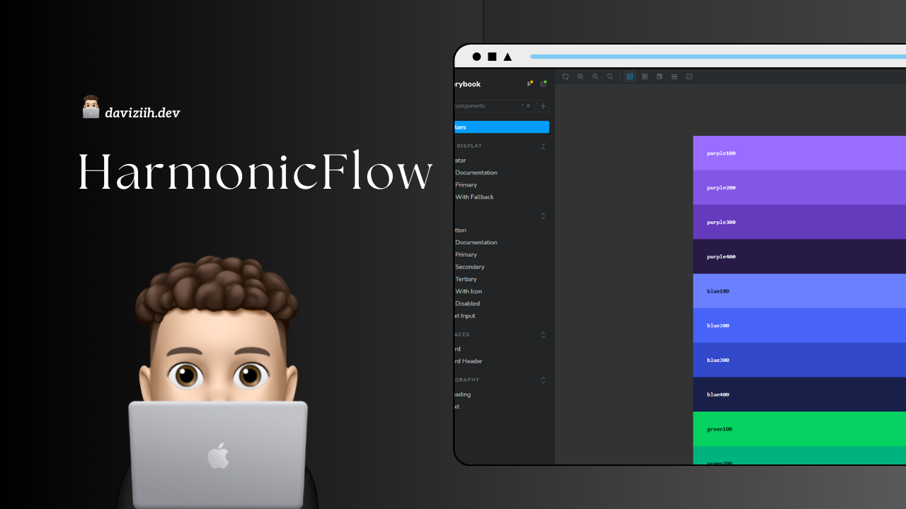

<h1 align="center">HarmonicFlow - Design System<h1/>

  

## 🚀 Tecnologias

Esse projeto foi desenvolvido com as seguintes tecnologias:

- React
- StoryBook
- Stitches 

## 💻 Projeto

HarmonicFlow é um design system moderno e flexível, criado com Stitches, projetado para facilitar a construção de interfaces web consistentes e acessíveis. Ele oferece uma biblioteca de componentes reutilizáveis, que permite aos desenvolvedores criar interfaces escaláveis de forma ágil, mantendo a harmonia visual e a eficiência no desenvolvimento.
